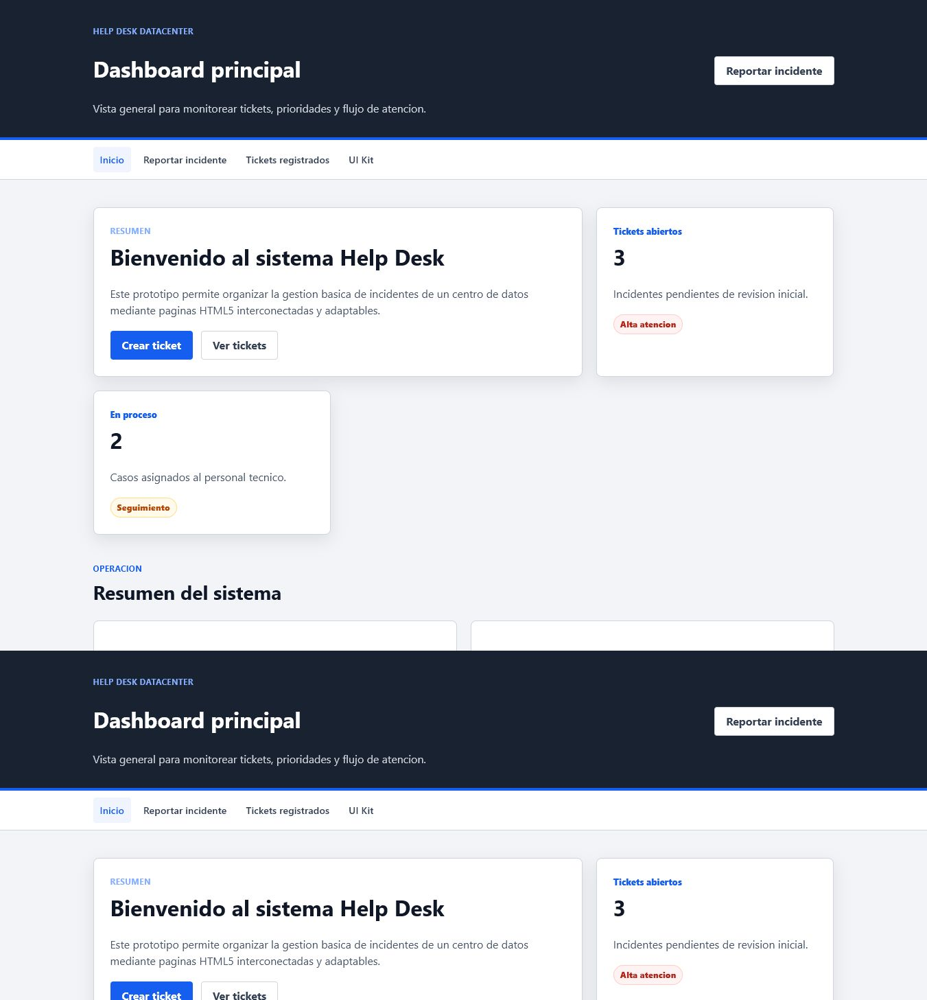
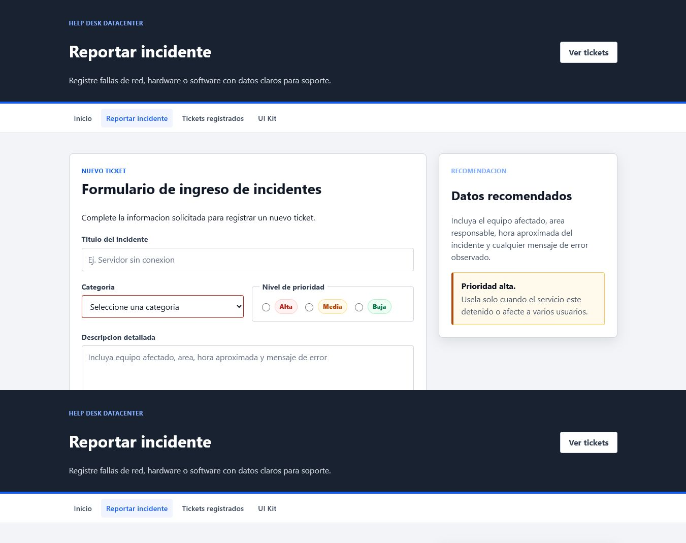
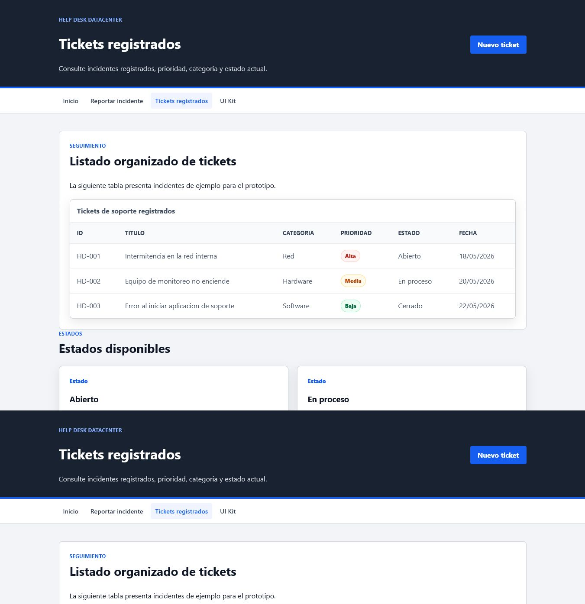

# Help Desk Datacenter

Prototipo web academico para la gestion de incidentes de un centro de datos.

Repositorio: https://github.com/cmancero1650-ux/helpdesk-datacenter

## Paginas principales

- `index.html`: demostracion del Design System.
- `style.css`: estilos reutilizables del UI Kit.
- `dashboard.html`: dashboard del sistema.
- `reportar.html`: formulario para registrar incidentes.
- `tickets.html`: listado de tickets.
- `frontend/`: interfaz moderna y responsive conectada a la API REST.
- `backend/`: API RESTful con Node.js, Express, MongoDB y autenticacion JWT.
- `db/`: esquema documental y datos iniciales de tickets.
- `docs/`: documentacion tecnica de endpoints y ejecucion local.

## Design System

La demostracion de componentes se encuentra en `index.html` y utiliza
la hoja de estilos `style.css`.

Componentes disponibles:

- Botones: `.btn`, `.btn--primary`, `.btn--secondary` y `.btn--danger`.
- Formularios: `.form-group` y `.form-control`.
- Tarjetas: `.ticket-card` y sus elementos internos.
- Prioridades: `.badge--high`, `.badge--medium` y `.badge--low`.
- Alertas: `.alert--success`, `.alert--warning` y `.alert--danger`.

Para reutilizar los componentes, enlace la hoja CSS en el documento HTML:

```html
<link rel="stylesheet" href="style.css">
```

Ejemplo de boton primario:

```html
<button class="btn btn--primary" type="button">Guardar ticket</button>
```

## Responsive Web Design

Las paginas `dashboard.html`, `reportar.html` y `tickets.html` integran el
UI Kit mediante `style.css` y usan Flexbox, CSS Grid y media queries.

Puntos aplicados:

- Navegacion flexible con adaptacion vertical en pantallas menores a `768px`.
- Dashboard organizado con CSS Grid.
- Formulario responsive con campos al `100%` en movil.
- Tabla de tickets convertida en tarjetas para evitar scroll horizontal.
- Etiqueta `<meta name="viewport">` incluida en todas las paginas.

Validaciones recomendadas para el informe:

- W3C Markup Validation Service para los archivos HTML.
- W3C CSS Validation Service para `style.css`.
- Capturas en escritorio, tablet y movil usando DevTools del navegador.

## Backend API REST

La API implementa autenticacion de usuarios y CRUD completo de tickets.

Stack utilizado:

- Node.js
- Express
- MongoDB con Mongoose
- JWT para autenticacion
- bcryptjs para contrasenas
- Helmet y CORS para seguridad basica

Endpoints principales:

- `POST /auth/register`: registrar usuario.
- `POST /auth/login`: iniciar sesion.
- `GET /tickets`: listar tickets.
- `GET /tickets/:id`: buscar ticket por id.
- `POST /tickets`: crear ticket.
- `PUT /tickets/:id`: actualizar ticket.
- `DELETE /tickets/:id`: eliminar ticket.

## Ejecucion local

Backend:

```bash
cd backend
npm install
copy .env.example .env
npm run dev
```

Si no tiene MongoDB instalado, en `backend/.env` puede usar:

```env
USE_MEMORY_DB=true
JWT_SECRET=clave_segura_para_desarrollo
```

Frontend:

```bash
npx http-server frontend -p 8080
```

Abrir en el navegador:

```text
http://localhost:8080
```

Usuario de prueba despues de ejecutar `npm run seed` con MongoDB real:

```text
admin@helpdesk.local
Admin123
```

La documentacion ampliada se encuentra en:

- `docs/API.md`
- `docs/INSTRUCCIONES.md`

## Capturas

Dashboard responsive:



Formulario de tickets:



Listado de tickets:


